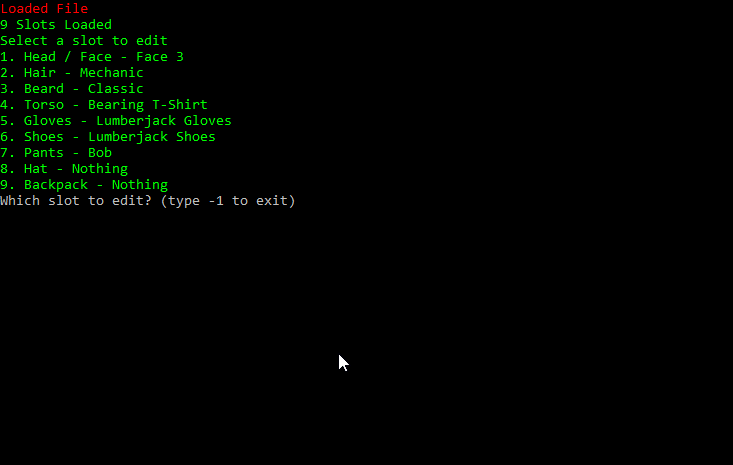
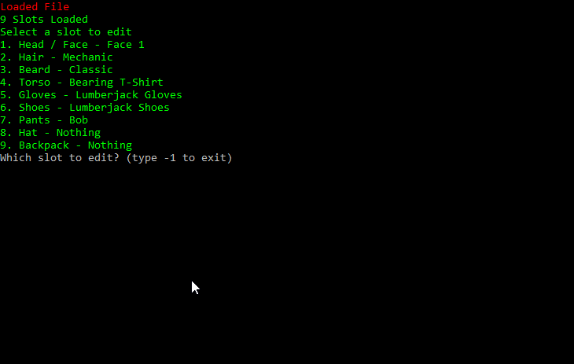

# Scrap Mechanic Character Editor
Scrap Mechanic Character Editor is a tool for advanced character customisation.
### Supports:
* Garment Stacking
* Garment Unequiping
* Adding new garment slots (useless right now because the game resrets the file back to 9 slots)
## Needs [Node.js](https://nodejs.org)
## Setup:
1. Run `install.bat` or manually run `npm i` 
1. Change the SteamID64 in `config.json` to your SteamID64
## How to use:
1. Launch the editor via `run.bat` or by manually running `node new.js`
1. Select a garment to edit.
1. Edit the garment using the ingame name of the garment
1. ( `Optional` ) Change the color index. (Only works for face slot and hair slot.)
## Old.js
`Old.js` is the first version of the editor that doesn't support scaleable slot count and color index editing.
## Preview:

